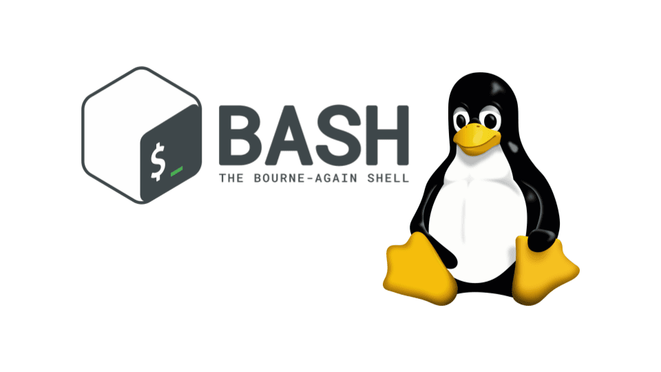

 

 

<h1 align="center">holbertonschool-shell</h1>

 

- ### **[00 - Shell - Basics](https://github.com/RazikaBengana/holbertonschool-shell/tree/main/basics)**
- ### **[01 - Shell - Permissions](https://github.com/RazikaBengana/holbertonschool-shell/tree/main/permissions)**
- ### **[02 - Shell - I/O Redirections and filters](https://github.com/RazikaBengana/holbertonschool-shell/tree/main/io_redirections_and_filters)**
- ### **[03 - Shell - Init files, variables and expansions](https://github.com/RazikaBengana/holbertonschool-shell/tree/main/init_files_variables_and_expansions)**