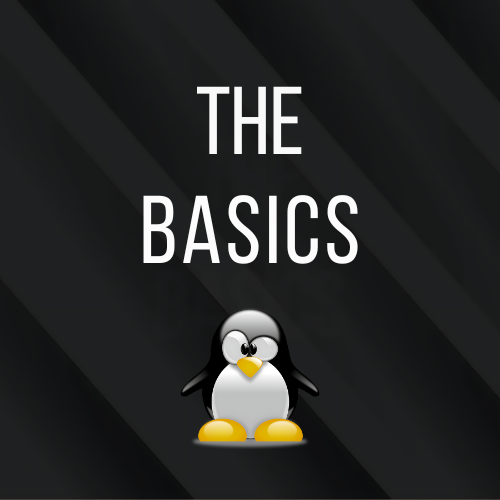

<div align="center">
<br>



</div>


<p align="center">


</p>


<h1 align="center">Shell, basics</h1>


<h3 align="center">
<a href="https://github.com/RazikaBengana/holbertonschool-shell/tree/main/basics#eye-about">About</a> •
<a href="https://github.com/RazikaBengana/holbertonschool-shell/tree/main/basics#hammer_and_wrench-tasks">Tasks</a> •
<a href="https://github.com/RazikaBengana/holbertonschool-shell/tree/main/basics#memo-learning-objectives">Learning Objectives</a> •
<a href="https://github.com/RazikaBengana/holbertonschool-shell/tree/main/basics#computer-requirements">Requirements</a> •
<a href="https://github.com/RazikaBengana/holbertonschool-shell/tree/main/basics#package-installation">More Info</a> •
<a href="https://github.com/RazikaBengana/holbertonschool-shell/tree/main/basics#mag_right-resources">Resources</a> •
<a href="https://github.com/RazikaBengana/holbertonschool-shell/tree/main/basics#bust_in_silhouette-authors">Authors</a> •
<a href="https://github.com/RazikaBengana/holbertonschool-shell/tree/main/basics#octocat-license">License</a>
</h3>

---

<!-- ------------------------------------------------------------------------------------------------- -->

<br>
<br>

## :eye: About

<br>

<div align="center">

**`Shell - basics`** theme focuses on fundamental command-line operations and file system navigation in Unix-like operating systems.
<br>
The scripts cover essential tasks such as listing directory contents, changing directories, creating and manipulating files and directories, and displaying file information.
<br>
<br>
This project has been created by **[Holberton School](https://www.holbertonschool.com/about-holberton)** to enable every student to understand how Shell works.

</div>

<br>
<br>

<!-- ------------------------------------------------------------------------------------------------- -->

## :hammer_and_wrench: Tasks

<br>

**`0. Where am I?`**

**`1. What’s in there?`**

**`2. There is no place like home`**

**`3. The long format`**

**`4. Hidden files`**

**`5. I love numbers`**

**`6. Welcome`**

**`7. Betty in my first directory`**

**`8. Bye bye Betty`**

**`9. Bye bye My first directory`**

**`10. Back to the future`**

**`11. Lists`**

**`12. File type`**

**`13. We are symbols, and inhabit symbols`**

**`14. Copy HTML files`**

**`15. Let’s move`**

**`16. Clean Emacs`**

**`17. Tree`**

<br>
<br>

<!-- ------------------------------------------------------------------------------------------------- -->

## :memo: Learning objectives

<br>

**_You are expected to be able to [explain to anyone](https://fs.blog/feynman-learning-technique/), without the help of Google:_**

<br>

```diff

General

+ What does RTFM mean?

+ What is a Shebang


What is the Shell

+ What is the shell

+ What is the difference between a terminal and a shell

+ What is the shell prompt

+ How to use the history (the basics)


Navigation

+ What do the commands or built-ins cd, pwd, ls do

+ How to navigate the filesystem

+ What are the . and .. directories

+ What is the working directory, how to print it and how to change it

+ What is the root directory

+ What is the home directory, and how to go there

+ What is the difference between the root directory and the home directory of the user root

+ What are the characteristics of hidden files and how to list them

+ What does the command cd - do


Looking Around

+ What do the commands ls, less, file do

+ How do you use options and arguments with commands

+ Understand the ls long format and how to display it

+ What does the ln command do

+ What do you find in the most common/important directories

+ What is a symbolic link

+ What is a hard link

+ What is the difference between a hard link and a symbolic link


Manipulating Files

+ What do the commands cp, mv, rm, mkdir do

+ What are wildcards and how do they work

+ How to use wildcards


Working with Commands

+ What do type, which, help, man commands do

+ What are the different kinds of commands

+ What is an alias

+ When do you use the command help instead of man


Reading Man Pages

+ How to read a man page

+ What are man page sections

+ What are the section numbers for User commands, System calls and Library functions


Keyboard Shortcuts for Bash

+ Common shortcuts for Bash


LTS

+ What does LTS mean?

```

<br>
<br>

<!-- ------------------------------------------------------------------------------------------------- -->

## :computer: Requirements

<br>

```diff

General

+ Allowed editors: vi, vim, emacs

+ All your scripts will be tested on Ubuntu 20.04 LTS

+ All your scripts should be exactly two lines long ($ wc -l file should print 2)

+ All your files should end with a new line

+ The first line of all your files should be exactly #!/bin/bash

+ A README.md file at the root of the repo, containing a description of the repository

+ A README.md file, at the root of the folder of this project, describing what each script is doing

- You are not allowed to use backticks, &&, || or ;

+ All your scripts must be executable. To make your file executable, use the chmod command: chmod u+x file. Later, we’ll learn more about how to utilize this command. 

```
<br>

**_Why all your files should end with a new line? See [HERE](https://unix.stackexchange.com/questions/18743/whats-the-point-in-adding-a-new-line-to-the-end-of-a-file/18789)_**

<br>
<br>

<!-- ------------------------------------------------------------------------------------------------- -->

## :keyboard: More Info

<br>

- Example of line count and first line:

<br>

```yaml
razika@ubuntu:/tmp$ wc -l 12-file_type 
2 12-file_type

razika@ubuntu:/tmp$ head -n 1 12-file_type 
#!/bin/bash

razika@ubuntu:/tmp$ 
```

<br>
<br>

:pushpin: **Note**:
<br>
<br>
In order to test your scripts, you will need to use this command: `chmod u+x file`. <br>
You can have a look at_ `man chmod`.

<br>
<br>

- Example:

<br>

```yaml
razika@ubuntu:/tmp$ ls
12-file_type
lll

razika@ubuntu:/tmp$ ls -la lll
-rw-rw-r-- 1 razika razika 15 Sep 19 21:05 lll

razika@ubuntu:/tmp$ cat lll
#!/bin/bash
ls

razika@ubuntu:/tmp$ ls -l lll
-rw-rw-r-- 1 razika razika 15 Sep 19 21:05 lll

razika@ubuntu:/tmp$ chmod u+x lll

razika@ubuntu:/tmp$ ls -l lll
-rwxrw-r-- 1 razika razika 15 Sep 19 21:05 lll

razika@ubuntu:/tmp$ ./lll
12-file_type
lll

razika@ubuntu:/tmp$
```
<br>
<br>

<!-- ------------------------------------------------------------------------------------------------- -->

## :mag_right: Resources

<br>

**_Do you need some help?_**

<br>

**Read or watch:**

* [What Is “The Shell”?](http://linuxcommand.org/lc3_lts0010.php)

* [Navigation](http://linuxcommand.org/lc3_lts0020.php)

* [Looking Around](http://linuxcommand.org/lc3_lts0030.php)

* [A Guided Tour](http://linuxcommand.org/lc3_lts0040.php)

* [Manipulating Files](http://linuxcommand.org/lc3_lts0050.php)

* [Working With Commands](http://linuxcommand.org/lc3_lts0060.php)

* [Reading Man pages](http://linuxcommand.org/lc3_man_pages/man1.html)

* [Keyboard Shortcuts for Bash](https://www.howtogeek.com/howto/ubuntu/keyboard-shortcuts-for-bash-command-shell-for-ubuntu-debian-suse-redhat-linux-etc/)

* [LTS](https://wiki.ubuntu.com/LTS)

* [Shebang](https://en.wikipedia.org/wiki/Shebang_%28Unix%29)

* [Linux file systems explained](https://www.linuxfoundation.org/blog/blog/classic-sysadmin-the-linux-filesystem-explained)

<br>

**`man` or `help`:**

* `cd`

* `ls`

* `pwd`

* `less`

* `file`

* `ln`

* `cp`

* `mv`

* `rm`

* `mkdir`

* `type`

* `which`

* `help`

* `man`

<br>
<br>

<!-- ------------------------------------------------------------------------------------------------- -->

## :bust_in_silhouette: Authors

<br>

**${\color{blue}Razika \space Bengana}$**

<br>
<br>

<!-- ------------------------------------------------------------------------------------------------- -->

## :octocat: License

<br>

```Shell - basics``` _project has no license specified._

<br>
<br>

---

<p align="center"><br>2022</p>