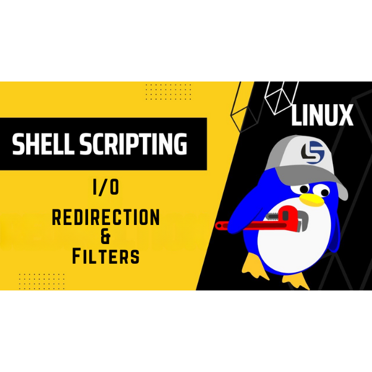

<div align="center">
<br>



</div>

<p align="center">


</p>


<h1 align="center">Shell, I/O Redirections and filters</h1>


<h3 align="center">
<a href="https://github.com/RazikaBengana/holbertonschool-shell/tree/main/io_redirections_and_filters#eye-about">About</a> •
<a href="https://github.com/RazikaBengana/holbertonschool-shell/tree/main/io_redirections_and_filters#hammer_and_wrench-tasks">Tasks</a> •
<a href="https://github.com/RazikaBengana/holbertonschool-shell/tree/main/io_redirections_and_filters#memo-learning-objectives">Learning Objectives</a> •
<a href="https://github.com/RazikaBengana/holbertonschool-shell/tree/main/io_redirections_and_filters#computer-requirements">Requirements</a> •
<a href="https://github.com/RazikaBengana/holbertonschool-shell/tree/main/io_redirections_and_filters#keyboard-more-info">More Info</a> •
<a href="https://github.com/RazikaBengana/holbertonschool-shell/tree/main/io_redirections_and_filters#mag_right-resources">Resources</a> •
<a href="https://github.com/RazikaBengana/holbertonschool-shell/tree/main/io_redirections_and_filters#bust_in_silhouette-authors">Authors</a> •
<a href="https://github.com/RazikaBengana/holbertonschool-shell/tree/main/io_redirections_and_filters#octocat-license">License</a>
</h3>

---

<!-- ------------------------------------------------------------------------------------------------- -->

<br>
<br>

## :eye: About

<br>

<div align="center">

**`Shell - I/O Redirections and filters`** theme focuses on the manipulation of input and output streams in Unix-like operating systems, allowing users to control where data comes from and where it goes.
<br>
The scripts demonstrate various techniques for redirecting standard input/output, piping commands, and using text processing tools to filter and transform data.
<br>
<br>
This project has been created by **[Holberton School](https://www.holbertonschool.com/about-holberton)** to enable every student to understand how Shell works.

</div>

<br>
<br>

<!-- ------------------------------------------------------------------------------------------------- -->

## :hammer_and_wrench: Tasks

<br>

**`0. Hello World`**

**`1. Confused smiley`**

**`2. Let's display a file`**

**`3. What about 2?`**

**`4. Last lines of a file`**

**`5. I'd prefer the first ones actually`**

**`6. Line #2`**

**`7. It is a good file that cuts iron without making a noise`**

**`8. Save current state of directory`**

**`9. Duplicate last line`**

**`10. No more javascript`**

**`11. Don't just count your directories, make your directories count`**

**`12. What’s new`**

**`13. Being unique is better than being perfect`**

**`14. It must be in that file`**

**`15. Count that word`**

**`16. What's next?`**

**`17. I hate bins`**

**`18. Letters only please`**

**`19. A to Z`**

**`20. Without C, you would live in hiago`**

**`21. esreveR`**

**`22. DJ Cut Killer`**

**`23. Empty casks make the most noise`**

**`24. A gif is worth ten thousand words`**

**`25. Acrostic`**

**`26. The biggest fan`**

<br>
<br>

<!-- ------------------------------------------------------------------------------------------------- -->

## :memo: Learning Objectives

<br>

**_You are expected to be able to [explain to anyone](https://fs.blog/feynman-learning-technique/), without the help of Google:_**

<br>

```diff

Shell, I/O Redirection

+ What do the commands head, tail, find, wc, sort, uniq, grep, tr do

+ How to redirect standard output to a file

+ How to get standard input from a file instead of the keyboard

+ How to send the output from one program to the input of another program

+ How to combine commands and filters with redirections


Special Characters

+ What are special characters

+ Understand what do the white spaces, single quotes, double quotes, backslash, comment, pipe, command separator, tilde and how and when to use them


Other Man Pages

+ How to display a line of text

+ How to concatenate files and print on the standard output

+ How to reverse a string

+ How to remove sections from each line of files

+ What is the /etc/passwd file and what is its format

+ What is the /etc/shadow file and what is its format

```

<br>
<br>

<!-- ------------------------------------------------------------------------------------------------- -->

## :computer: Requirements

<br>

```diff

General

+ Allowed editors: vi, vim, emacs

+ All your scripts will be tested on Ubuntu 20.04 LTS

+ All your scripts should be exactly two lines long ($ wc -l file should print 2)

+ All your files should end with a new line

+ The first line of all your files should be exactly #!/bin/bash

+ A README.md file, at the root of the folder of the project, describing what each script is doing

- You are not allowed to use backticks, &&, || or ;

+ All your files must be executable 

- You are not allowed to use sed or awk

```
<br>

**_Why all your files should end with a new line? See [HERE](https://unix.stackexchange.com/questions/18743/whats-the-point-in-adding-a-new-line-to-the-end-of-a-file/18789)_**

<br>
<br>

<!-- ------------------------------------------------------------------------------------------------- -->

## :keyboard: More Info

<br>

- Read your `/etc/passwd` and `/etc/shadow` files.

- You do not have to learn about `fmt`, `pr`, `du`, `gzip`, `tar`, `lpr`, `sed` and `awk` yet.

<br>
<br>

<!-- ------------------------------------------------------------------------------------------------- -->

## :mag_right: Resources

<br>

**_Do you need some help?_**

<br>

**Read or watch:**

* [Shell, I/O Redirection](https://linuxcommand.org/lc3_lts0070.php)

* [Special Characters](https://mywiki.wooledge.org/BashGuide/SpecialCharacters)

<br>

**`man` or `help`:**

* `echo`

* `cat`

* `head`

* `tail`

* `find`

* `wc`

* `sort`

* `uniq`

* `grep`

* `tr`

* `rev`

* `cut`

* `passwd (5)` (i.e. `man 5 passwd`)

<br>
<br>

<!-- ------------------------------------------------------------------------------------------------- -->

## :bust_in_silhouette: Authors

<br>


<br>
<br>

<!-- ------------------------------------------------------------------------------------------------- -->

## :octocat: License

<br>

```Shell - I/O Redirections and filters``` _project has no license specified._

<br>
<br>

---

<p align="center"><br>2022</p>