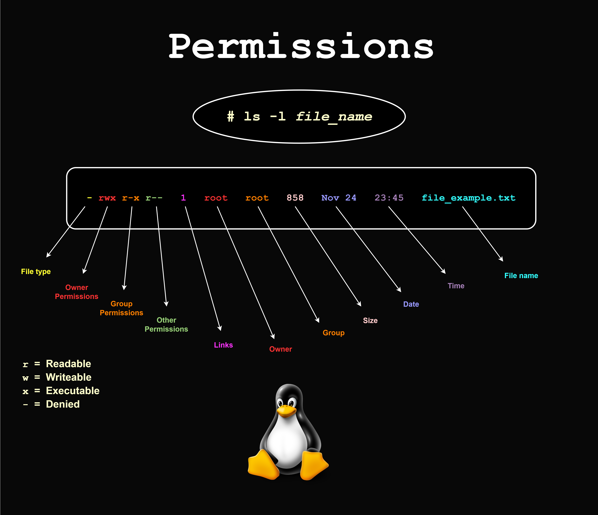

<div align="center">
<br>



</div>


<p align="center">


</p>


<h1 align="center">Shell, permissions</h1>


<h3 align="center">
<a href="https://github.com/RazikaBengana/holbertonschool-shell/tree/main/permissions#eye-about">About</a> •
<a href="https://github.com/RazikaBengana/holbertonschool-shell/tree/main/permissions#hammer_and_wrench-tasks">Tasks</a> •
<a href="https://github.com/RazikaBengana/holbertonschool-shell/tree/main/permissions#memo-learning-objectives">Learning Objectives</a> •
<a href="https://github.com/RazikaBengana/holbertonschool-shell/tree/main/permissions#computer-requirements">Requirements</a> •
<a href="https://github.com/RazikaBengana/holbertonschool-shell/tree/main/permissions#mag_right-resources">Resources</a> •
<a href="https://github.com/RazikaBengana/holbertonschool-shell/tree/main/permissions#bust_in_silhouette-authors">Authors</a> •
<a href="https://github.com/RazikaBengana/holbertonschool-shell/tree/main/permissions#octocat-license">License</a>
</h3>

---

<!-- ------------------------------------------------------------------------------------------------- -->

<br>
<br>

## :eye: About

<br>

<div align="center">
 
**`Shell - permissions`** theme focuses on the access control mechanisms in Unix-like operating systems that determine who can read, write, or execute files and directories.
<br>
The scripts demonstrate operations like changing ownership, modifying access rights, and setting special permissions using specific commands.
<br>
<br>
This project has been created by **[Holberton School](https://www.holbertonschool.com/about-holberton)** to enable every student to understand how Shell works.

</div>

<br>
<br>

<!-- ------------------------------------------------------------------------------------------------- -->

## :hammer_and_wrench: Tasks

<br>

**`0. My name is Betty`**

**`1. Who am I`**

**`2. Groups`**

**`3. New owner`**

**`4. Empty!`**

**`5. Execute`**

**`6. Multiple permissions`**

**`7. Everybody!`**

**`8. James Bond`**

**`9. John Doe`**

**`10. Look in the mirror`**

**`11. Directories`**

**`12. More directories`**

**`13. Change group`**

**`14. Owner and group`**

**`15. Symbolic links`**

**`16. If only`**

<br>
<br>

<!-- ------------------------------------------------------------------------------------------------- -->

## :memo: Learning objectives

<br>

**_You are expected to be able to [explain to anyone](https://fs.blog/feynman-learning-technique/), without the help of Google:_**

<br>

```diff

Permissions

+ What do the commands chmod, sudo, su, chown, chgrp do

+ Linux file permissions

+ How to represent each of the three sets of permissions (owner, group, and other) as a single digit

+ How to change permissions, owner and group of a file

+ Why can’t a normal user chown a file

+ How to run a command with root privileges

+ How to change user ID or become superuser


Other Man Pages

+ How to create a user

+ How to create a group

+ How to print real and effective user and group IDs

+ How to print the groups a user is in

+ How to print the effective userid

```

<br>
<br>

<!-- ------------------------------------------------------------------------------------------------- -->

## :computer: Requirements

<br>

```diff

General

+ Allowed editors: vi, vim, emacs

+ All your scripts will be tested on Ubuntu 20.04 LTS

+ All your scripts should be exactly two lines long ($ wc -l file should print 2)

+ All your files should end with a new line

+ The first line of all your files should be exactly #!/bin/bash

+ A README.md file, at the root of the folder of the project, describing what each script is doing

- You are not allowed to use backticks, &&, || or ;

+ All your files must be executable 

```
<br>

**_Why all your files should end with a new line? See [HERE](https://unix.stackexchange.com/questions/18743/whats-the-point-in-adding-a-new-line-to-the-end-of-a-file/18789)_**

<br>
<br>

<!-- ------------------------------------------------------------------------------------------------- -->

## :mag_right: Resources

<br>

**_Do you need some help?_**

<br>

**Read or watch:**

* [Permissions](http://linuxcommand.org/lc3_lts0090.php)

<br>

**`man` or `help`:**

* `chmod`

* `sudo`

* `su`

* `chown`

* `chgrp`

* `id`

* `groups`

* `whoami`

* `adduser`

* `useradd`

* `addgroup`

<br>
<br>

<!-- ------------------------------------------------------------------------------------------------- -->

## :bust_in_silhouette: Authors

<br>

**${\color{blue}Razika \space Bengana}$**

<br>
<br>

<!-- ------------------------------------------------------------------------------------------------- -->

## :octocat: License

<br>

```Shell - permissions``` _project has no license specified._

<br>
<br>

---

<p align="center"><br>2022</p>